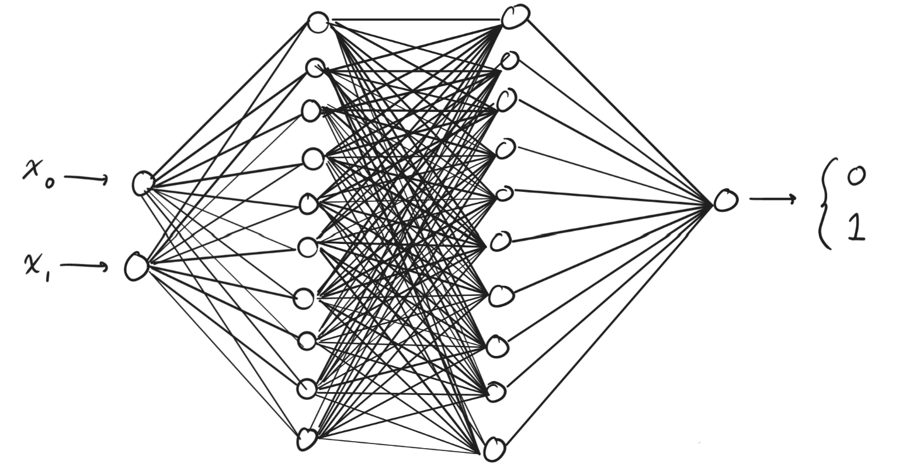

# Writing a Neural Network from Scratch!

This personal project will cover the journey it takes it create a 'simple' multilayer perceptron using C++ <br>
The final product will be a binary classification network with the following architecture:<br><br>
<br>
```
INPUT (2 nodes) --> HIDDEN_LAYER (10 nodes) --> HIDDEN_LAYER (10 nodes) --> OUTPUT (1 node)
```
The dataset we will be using is sklearn.datasets.make_circles<br>
This dataset will require the use of non-linearity, introduced with ReLU functions between the hidden layers. 
<br>
This project will be split into the following parts:
1. Define all the math within a nerual network in general terms
2. Define all the math required for _our_ network
3. Translate the math into C++
4. Test against PyTorch model
